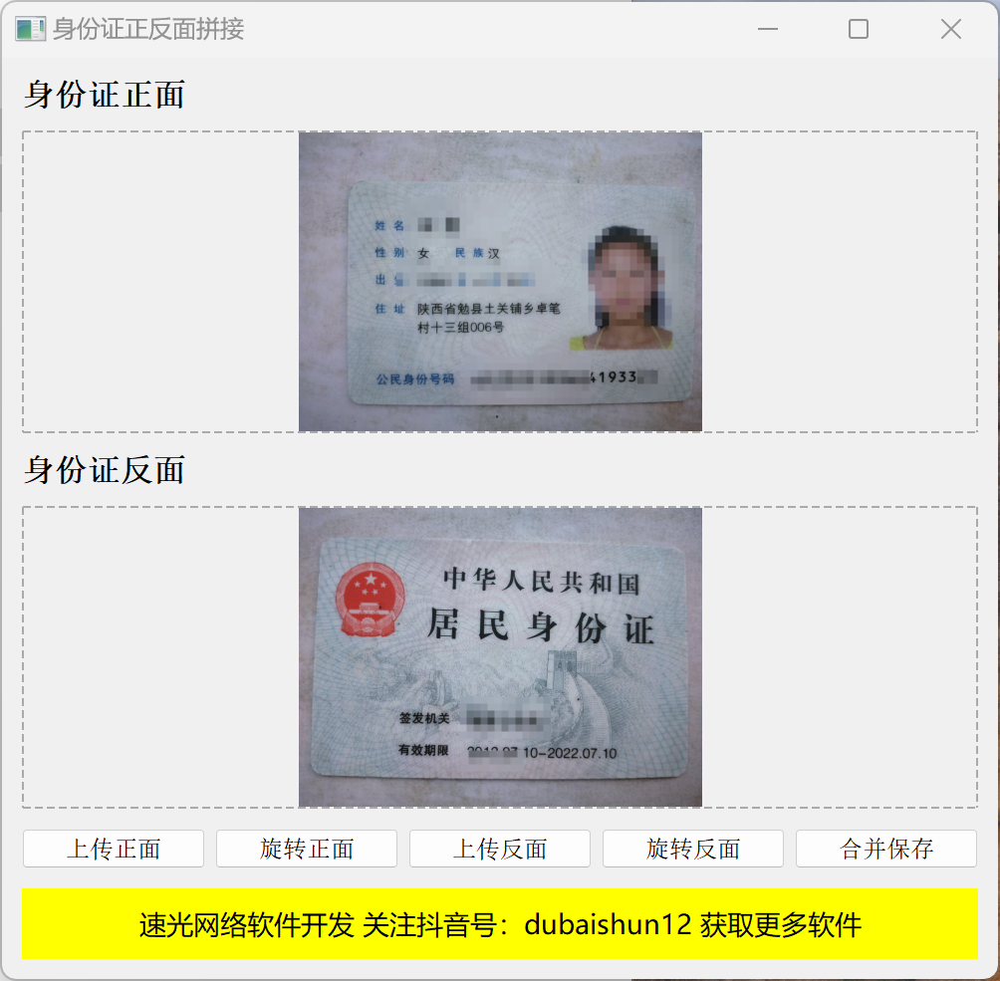

# 身份证正反面拼接工具

一款身份证正反面拼接工具，支持图片上传、旋转和合并功能。

## 功能特点

- 📷 支持拖放上传身份证正反面图片
- 🔄 图片旋转功能，可调整图片方向
- 🖼️ 自动拼接身份证正反面图片
- 💾 高质量保存合并后的图片
- 🎯 简洁易用的界面设计

## 使用说明

1. 点击"上传正面"按钮或拖放图片到正面区域上传身份证正面照片
2. 点击"上传反面"按钮或拖放图片到反面区域上传身份证反面照片
3. 如有需要，可使用"旋转正面"或"旋转反面"按钮调整图片方向
4. 点击"合并保存"按钮选择保存路径，完成图片拼接

## 系统要求

- Windows 操作系统
- Python 3.6+
- 支持常见图片格式：PNG, JPG, JPEG, BMP, GIF

## 安装方法

1. 克隆或下载本项目到本地
2. 安装所需依赖：
   ```
   pip install PyQt5 pillow wmi
   ```

## 运行程序

执行以下命令启动程序：
```
python 身份证正反面拼接.py
```



## 技术支持

- **速光网络软件开发**
- 官网：suguang.cc
- 联系电话/微信：15120086569
- 抖音号：dubaishun12

## 版权信息

Copyright © 2025 速光网络软件开发. All rights reserved.

## 许可证

本项目仅供学习交流使用，未经许可不得用于商业用途。